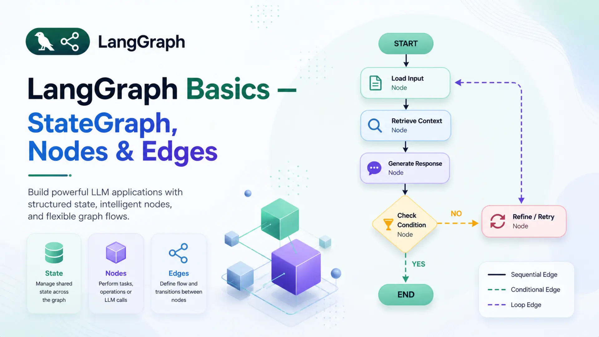

# New Blog Post — Step-by-Step Guide

## Writing Guidelines

**1. Write to a standard.**
Professional public website — every sentence must be publication-ready: correct grammar, consistent tone, no typos.

**2. Write simply and user-friendly.**
Assume the reader is intelligent but new to the topic. Avoid unexplained jargon; define technical terms on first use.

**3. Use examples.**
Show a concrete real-world scenario or code snippet alongside every abstract concept.

**4. No plagiarism.**
All content must be original. Rewrite ideas in your own words; cite sources in the References section.

**5. Use meaningful Unicode icons.**
Use for section headers, callout boxes, and list items where they add clarity. One icon per heading is enough. Match icons to topic (🔍 search, 🗄️ database, 🤖 AI, ⚙️ config).

**6. Smooth transitions between sections.**
End each section with a sentence that leads into the next. The reader should never feel lost.

**7. Write elaborately but comprehensively.**
Cover the topic fully — don't skip steps. Every paragraph should earn its place.

**8. Write like a human, not a machine.**
- Vary sentence length. Occasionally use contractions.
- Avoid AI filler: "It is worth noting", "In conclusion", "Delve into", "As we can see".
- Read your draft aloud. If it sounds robotic, rewrite it.

## Step 1 — Assign ID and filename

Check `data/posts.json` for the highest `id`. New post = that id + 1.
- File: `blogs/blog_N.html`
- Image folder: `img/blog_N/`
- Thumbnail: `img/blog_N/thumbnail.webp`

## Step 2 — Add entry to `data/posts.json`

Append at the **end** of the array (order determines the related posts slider sequence):

```json
{
    "id": 8,
    "author": "MD SHAFIQUL ISLAM",
    "author_img": "../img/author/shafiqul.jpg",
    "category": ["Tag1", "Tag2"],
    "image": "./img/blog_8/thumbnail.webp",
    "title": "Full title of the post",
    "date": "28 Jul 2025",
    "description": "One or two sentence description shown on the homepage card.",
    "readMoreUrl": "./blogs/blog_8.html"
}
```

- `image` / `readMoreUrl` use `./` — relative to site root (used by `site.js`)
- `author_img` uses `../` — relative to `blogs/` folder (used by `detail.js`)
- Date format: `DD Mon YYYY` (e.g. `28 Jul 2025`)

## Step 3 — Create image folder

```
img/blog_8/thumbnail.webp     ← required
img/blog_8/any_other.webp     ← content images
```

Formats: `.webp` for thumbnails, `.webp`/`.png` for diagrams, `.jpg` for photos.

## Step 4 — Create `blogs/blog_N.html`

Copy `blogs/blog_7.html` as a starting point. Structure below is verified from actual files — do not reorder.

### Complete `<head>`

```html
<!doctype html>
<html lang="en">
<head>
  <!-- Google Analytics -->
  <script async src="https://www.googletagmanager.com/gtag/js?id=G-6SEFZQJHM1"></script>
  <script>
    window.dataLayer = window.dataLayer || [];
    function gtag() { dataLayer.push(arguments); }
    gtag("js", new Date());
    gtag("config", "G-6SEFZQJHM1", { cookie_domain: "shafiqulai.github.io" });
  </script>
  <meta charset="utf-8" />
  <title>Full Post Title Here</title>
  <meta name="viewport" content="width=device-width, initial-scale=1.0" />
  <meta name="description" content="Same text as posts.json description field." />
  <meta name="author" content="MD SHAFIQUL ISLAM" />
  <link rel="icon" href="../img/others/favicon.ico" type="image/x-icon" />
  <!-- Fonts -->
  <link rel="preconnect" href="https://fonts.googleapis.com" />
  <link rel="preconnect" href="https://fonts.gstatic.com" crossorigin />
  <link href="https://fonts.googleapis.com/css2?family=Open+Sans:wght@400;600;700&display=swap" rel="stylesheet" />
  <!-- CSS (this order matters) -->
  <link rel="stylesheet" href="../css/bootstrap.min.css" />
  <link rel="stylesheet" href="../css/swiper-bundle.min.css" />
  <link rel="stylesheet" href="../css/style.css" />
  <link rel="stylesheet" href="../css/prism.css" />
</head>
```

### Scripts before `</body>` (this order matters)

```html
  <script src="../js/bootstrap.bundle.min.js"></script>
  <script src="../js/components.js"></script>
  <script src="../js/site.js"></script>
  <script src="../js/swiper-bundle.min.js"></script>
  <script src="../js/prism.js" data-manual></script>
  <script src="../js/code-highlight.js"></script>
  <script src="../js/detail.js"></script>
  <!-- Add below only if the post contains Mermaid diagrams -->
  <script src="../js/mermaid.min.js"></script>
  <script>mermaid.initialize({ startOnLoad: true, theme: 'default' });</script>
</body>
```

### Outer shell

`<div id="reading-progress"></div>` goes directly after `<body>`, outside `#wrapper`.

**Short post (no sidebar):**
```html
<body>
  <div id="reading-progress"></div>
  <div id="wrapper">
    <div id="site-header"></div>
    <section id="content">
      <div class="container">
        <div id="blogContainer"><!-- blog content --></div>
      </div>
    </section>
    <div id="site-footer"></div>
  </div>
</body>
```

**Long post — with TOC sidebar (recommended for 5+ sections):**
```html
<body>
  <div id="reading-progress"></div>
  <div id="wrapper">
    <div id="site-header"></div>
    <section id="content">
      <div class="container">
        <div class="blog-detail-layout">
          <aside class="toc-sidebar" id="tocSidebar">
            <div class="toc-sidebar-header">
              <p class="toc-sidebar-title">Contents</p>
            </div>
            <ul class="toc-sidebar-list">
              <li><a href="#section-1">1. Section One</a></li>
              <li class="toc-sidebar-sub"><a href="#sub-1-1">1.1 Sub-section</a></li>
              <li><a href="#section-2">2. Section Two</a></li>
            </ul>
          </aside>
          <div class="blog-detail-main">
            <div id="blogContainer"><!-- blog content --></div>
          </div>
        </div>
        <!-- end .blog-detail-layout -->

        <!-- Related posts goes HERE — outside .blog-detail-layout, inside .container -->
        <!-- This ensures the TOC sidebar only stretches to the last content section, not to the footer -->

      </div>
    </section>
    <div id="site-footer"></div>
  </div>
</body>
```

Sidebar hidden on mobile; inline `.blg-toc-container` shown instead. Scroll-spy auto-activates when `#tocSidebar` is present.

## Step 5 — Content structure inside `#blogContainer`

```html
<!-- Title -->
<div class="container blg-title-container">
  <h2 class="blg-title">Post Title Here</h2>
</div>

<!-- Author — leave empty, detail.js fills from posts.json -->
<div class="author_section">
  
  <div class="author_details">
    <span id="author_name" class="author_name"></span>
    <span id="published_date" class="published_date"></span>
  </div>
</div>

<!-- Thumbnail -->
<div class="blg-img-container">
  
</div>

<!-- Inline TOC (visible on mobile) -->
<div class="blg-toc-container">
  <h2>📚 Table of Contents</h2>
  <ol class="blg-toc-ol">
    <li class="blg-toc-li"><a href="#section-1">1. Section One</a></li>
    <ul class="blg-toc-ul">
      <li class="blg-toc-li"><a href="#sub-1-1">1.1 Sub-section</a></li>
    </ul>
  </ol>
</div>

<!-- Content sections (repeat per section) -->
<div class="blg-section">
  <a id="section-1" class="blg-anchor"></a>
  <div class="blg-main-header"><h2>📘 1. Section One</h2></div>
  <!-- paragraphs, code blocks, images, callouts, etc. -->
  <hr class="blg-hr">
</div>

<!-- Trailing: Tech Stacks, Download, References — see instructions.md §21b -->

</div><!-- end #blogContainer -->
</div><!-- end .blog-detail-main -->
</div><!-- end .blog-detail-layout -->

<!-- Related posts MUST be outside .blog-detail-layout (inside .container).
     This keeps the TOC sidebar height limited to the content sections. -->
<div class="related-posts-section">
  <div class="blog-title-bar">
    
    <h2>Related Blog Posts</h2>
  </div>
  <div class="related-posts-wrapper">
    <div class="related-posts-swiper-area">
      <div class="swiper" id="postContainer">
        <div class="swiper-wrapper"><!-- populated by detail.js --></div>
      </div>
      <div class="swiper-button-prev"></div>
      <div class="swiper-button-next"></div>
    </div>
    <div class="blg-slide-counter">
      <div class="slide-progress-bar">
        <div class="slide-progress-fill" id="slideProgressFill"></div>
      </div>
      <div class="slide-counter-label">
        <span id="currentSlide">1</span> / <span id="totalSlides">1</span>
      </div>
    </div>
  </div>
</div>
```

Full HTML patterns for every element: `.claude/instructions.md`

## Step 5b — Installation & Setup section (LangGraph series only)

For any post in the LangGraph series, Section 2 (Installation & Setup) must follow this structure:

```
1. Python version   → state 3.12, show: python --version
2. Virtual env      → python -m venv langgraph
                      source langgraph/bin/activate      (macOS/Linux)
                      langgraph\Scripts\activate         (Windows)
3. requirements.txt → show full file as properties block, then pip install -r requirements.txt
4. Gemini API key   → Google AI Studio link, .env contents, .gitignore warning
5. Project tree     → blg-tree with all files for that post
6. File-to-section  → sentence mapping each file to its section number
7. Subsection 2.1   → Configuring the LLM (config.py + llm.py code + explanation)
```

Never show a bare `pip install pkg1 pkg2` one-liner — always use `requirements.txt`.

## Step 6 — Code blocks and trees

**Code blocks** — always set `data-lang`:
```html
<div class="blg-code-block" data-lang="python">def run(query):
    return chain.invoke({"input": query})</div>
```
Valid values: `python` `bash` `docker` `yaml` `json` `properties` `markdown`

**Directory trees** — align comments with spaces (not CSS):
```html
<div class="blg-tree"><span class="tree-root">project/</span>
<span class="tree-pipe">├── </span><span class="tree-file">app.py</span>           <span class="tree-comment"># entry point</span>
<span class="tree-pipe">├── </span><span class="tree-file">config.py</span>        <span class="tree-comment"># settings</span>
<span class="tree-pipe">└── </span><span class="tree-spec">.env</span>             <span class="tree-comment"># API keys</span></div>
```
Alignment rule: all comments start at column = `max(pipe_len + name_len) + 6`.

## Step 7 — Pre-publish checklist

### Setup
- [ ] Entry appended to `data/posts.json` — homepage card auto-generated from this
- [ ] `thumbnail.webp` placed in `img/blog_N/`
- [ ] New tech stack icons added to `img/technical_stack/` (if needed)

### Content — in page order
- [ ] Blog title (`.blg-title`)
- [ ] Preface / intro paragraph
- [ ] Inline Table of Contents (`.blg-toc-container`) — visible on mobile
- [ ] Left sidebar TOC (`#tocSidebar`) — sticky on desktop (add for long posts)
- [ ] All sections and sub-sections written
- [ ] Content images with captions (if any)
- [ ] Directory tree structure (if project-based post)
- [ ] Code blocks with correct `data-lang` (if any)
- [ ] Tables (if any)
- [ ] Technical stacks section
- [ ] Download source code link (if applicable)
- [ ] References section
- [ ] Related posts shell present at bottom of `#blogContainer`

### Technical
- [ ] `<title>` tag matches `.blg-title` text
- [ ] All `.blg-code-block` have `data-lang` attribute
- [ ] All `.blg-tree` comments column-aligned with spaces
- [ ] All TOC `href="#id"` match corresponding `.blg-anchor` `id=` values
- [ ] No `style=""` attributes anywhere in blog content
- [ ] If post uses Mermaid: `mermaid.min.js` script added at bottom (local, not CDN)

### After publishing
- [ ] Add new URL to `sitemap.xml`:
  ```xml
  <url>
      <loc>https://shafiqulai.github.io/blogs/blog_N.html</loc>
  </url>
  ```
- [ ] Submit URL in Google Search Console → URL Inspection → Request Indexing
